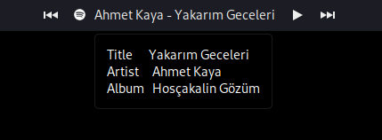

# xfce4-spotify-panel

## Description 
A very simple Spotify script for xfce4-genmon-plugin to displays current playing song. Click icon to focus the sporify window (or lanuch spotify when not already running). Tooltip show more song information. 




## Configuration 
The variable `DISPALY_TITLE_MAX_LENGTH` adjusts how many chars of the song title to display. 

I am using flatpak spotify


## Requirements
`xfce4-panel`

`xfce4-genmon-plugin`

`spotify`

## Installation

Add a Generic Monitor to your xfce 4 panel. Enter path to `spotify-panel.sh` in the Command field of the Properties section of the plugin. 

Add some Launchers if you want to control the spotify from panel, like changing track to prev or next or pause or play the track. Enther path to `sp.sh` with a command

ex) if you want to play the next track just use
```bash
sp.sh next
```

## sp.sh usage

```bash
  echo "Usage: sp [command]"
  echo "Control a running Spotify instance from the command line."
  echo ""
  echo "  sp play       - Play/pause Spotify"
  echo "  sp pause      - Pause Spotify"
  echo "  sp next       - Go to next track"
  echo "  sp prev       - Go to previous track"
  echo ""
  echo "  sp current    - Format the currently playing track"
  echo "  sp metadata   - Dump the current track's metadata"
  echo "  sp eval       - Return the metadata as a shell script"
  echo ""
  echo "  sp art        - Print the URL to the current track's album artwork"
  echo "  sp display    - Display the current album artwork with \`display\`"
  echo "  sp feh        - Display the current album artwork with \`feh\`"
  echo ""
  echo "  sp url        - Print the HTTP URL for the currently playing track"
  echo "  sp clip       - Copy the HTTP URL to the X clipboard"
  echo "  sp http       - Open the HTTP URL in a web browser"
  echo ""
  echo "  sp open <uri> - Open a spotify: uri"
  echo "  sp search <q> - Start playing the best search result for the given query"
  echo ""
  echo "  sp version    - Show version information"
  echo "  sp help       - Show this information"
  echo ""
  echo "Any other argument will start a search (i.e. 'sp foo' will search for foo)."
```

## Links

https://gitlab.xfce.org/panel-plugins/xfce4-genmon-plugin

